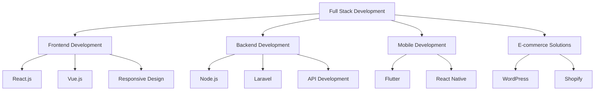

# 👋 Hello and welcome to my GitHub profile!

<div align="center">
  
</div>

<div align="center">
  <a href="https://www.linkedin.com/in/bouchelaghem-mohamed-seddik-454a62352/" target="_blank">
    
  </a>
  <a href="https://www.instagram.com/mohamed.sdike/profilecard/?igsh=Nzlmcm1vaWs3dHll" target="_blank">
    
  </a>
  <a href="https://wa.me/213779154202" target="_blank">
    
  </a>
</div>

---

## 👨‍💻 About Me

I am a passionate **Full Stack Developer** specializing in building high-performance and user-friendly web and mobile applications. I love tackling technical challenges and exploring new technologies to optimize my projects.

```javascript
const mohamed = {
  name: "Mohamed Seddik Bouchelaghem",
  role: "Full Stack Developer",
  location: "Algeria 🇩🇿",
  passions: ["Web Development", "Mobile Apps", "Problem Solving", "New Technologies"],
  currentlyLearning: "Advanced React Native & Cloud Architecture",
  askMeAbout: ["React", "Flutter", "Node.js", "Laravel", "E-commerce"],
  funFact: "I can debug code faster than I can debug my life! 😄"
};
```

---

## 🛠️ Technologies & Tools

### 💻 **Programming Languages**
<div align="left">
  
  
  
  
  
  
  
  
  
  
  
</div>

### 🚀 **Frameworks & Libraries**
<div align="left">
  
  
  
  
  
  
  
  
  
  
  
  
  
</div>

### 🧠 **Runtime & Tools**
<div align="left">
  
  
  
  
  
  
  
</div>

### 🗄️ **Databases & Backend Services**
<div align="left">
  
  
  
  
  
</div>

### 🛒 **CMS & E-commerce**
<div align="left">
  
  
  
</div>

---

## 🎯 What I Do



---

## 📊 GitHub Stats

<div align="center">
  
  
</div>

<div align="center">
  
</div>

---

## 🏆 GitHub Trophies

<div align="center">
  
</div>

---

## 🐍 Contribution Graph

<div align="center">
  
</div>

---

## 💼 Recent Projects

🚀 **Coming Soon!** - Currently working on exciting projects that will be showcased here.

---

## 📈 Profile Views

<div align="center">
  
</div>

---

## 🤝 Let's Connect!

I'm always open to discussing new opportunities, collaborating on interesting projects, or just having a chat about technology!

<div align="center">
  <a href="https://www.linkedin.com/in/bouchelaghem-mohamed-seddik-454a62352/" target="_blank">
    
  </a>
  <a href="https://www.instagram.com/mohamed.sdike/profilecard/?igsh=Nzlmcm1vaWs3dHll" target="_blank">
    
  </a>
  <a href="https://wa.me/213779154202" target="_blank">
    
  </a>
</div>

---

<div align="center">
  <h3>⭐ Don't forget to star my repositories if you find them useful! ⭐</h3>
  <p><em>Happy coding! 🚀</em></p>
</div>

---

*"Code is like humor. When you have to explain it, it's bad."* – Cory House
